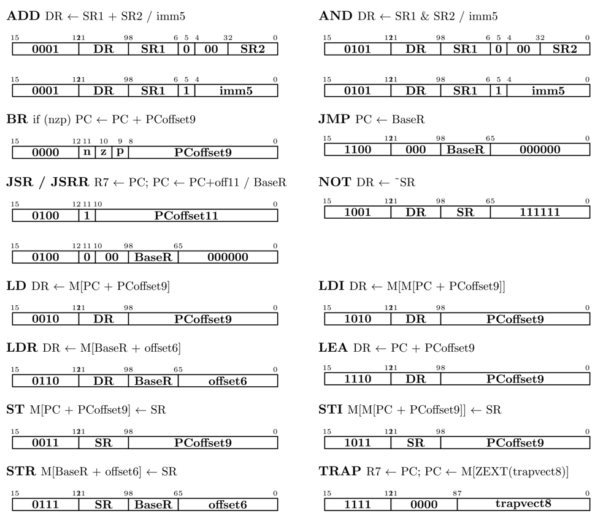
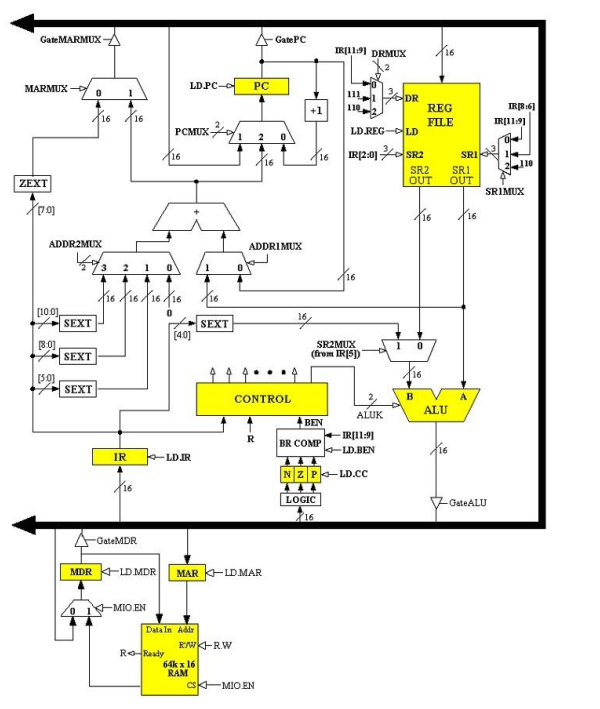
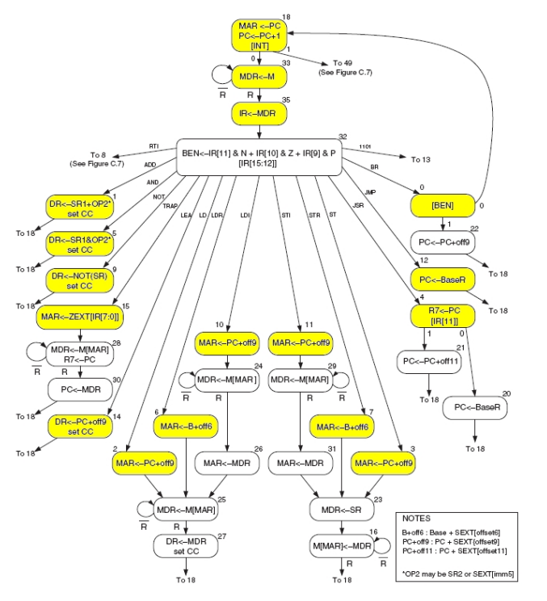
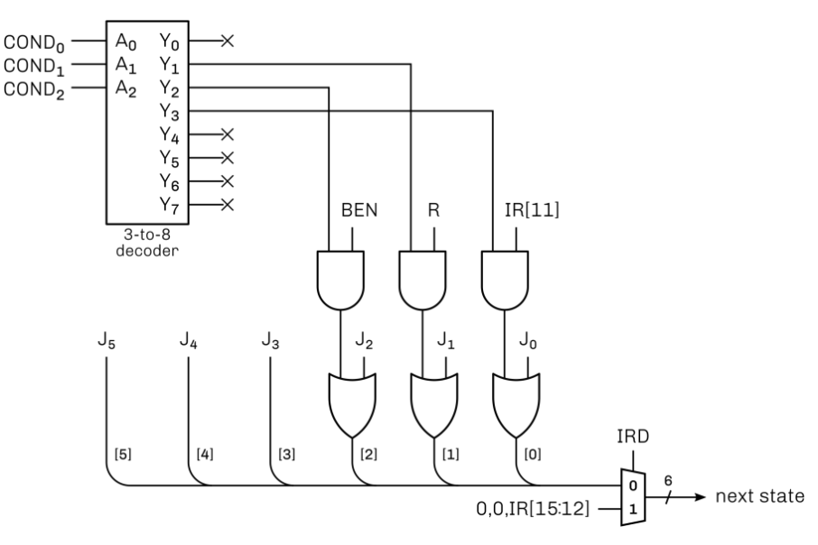
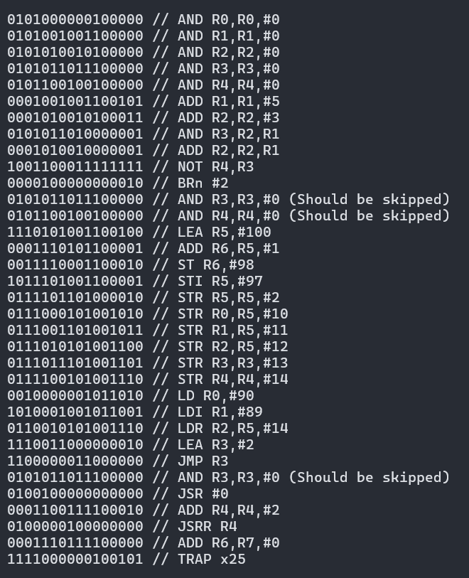

# LC-3 CPU
This is a personal project where I built an RTL implementation of the LC-3 CPU from scratch in Verilog.

## Table of Contents
- [Overview](#overview)
- [Architecture](#architecture)
  - [Instruction Set](#instruction-set)
  - [CPU](#cpu)
  - [Memory](#memory)
- [Microarchitecture](#microarchitecture)
  - [ALU](#alu)
  - [Register File](#register-file)
  - [BEN](#ben)
  - [SRAM](#sram)
  - [Control](#control)
  - [Other](#other)
    - [Multiplexers](#multiplexers)
    - [Registers](#registers)
    - [SEXT/ZEXT](#sextzext)
- [Simulation](#simulation)
  - [Test Program](#test-program)

## Overview
Little Computer 3, or LC-3, is primarily an instruction set architecture (ISA) designed as an educational tool for computer architecture and assembly language programming, developed by Dr. Yale Patt and Dr. Sanjay Patel.

This project is an RTL implementation of the LC-3 CPU, built from scratch in Verilog, including a full 16-bit datapath, microprogrammed control unit, and 64K x 16 SRAM with a ready signal. 14 instructions of the LC-3 ISA were implemented and verified through a combination of module-level testbenches and a full integration test using a machine code program.

## Architecture

### Instruction Set
Each instruction in the LC-3 ISA is 16 bits wide. Bits [15:12] specify the opcode, which determines which operation is performed. Bits [11:0] carry the remaining operand information needed to execute the instruction, such as register specifiers, immediate values, and PC offsets.

The following 14 instructions were implemented in this project:

### CPU
The CPU is implemented as a single top-level module (`lc3_cpu.v`) that instantiates and connects all datapath and control components. It contains a 16-bit bus that components communicate through. The bus is driven by either zero or one of four sources at any given time, selected by tri-state buffer gate control signals (`GatePC`, `GateMDR`, `GateALU`, `GateMARMUX`) asserted by the control unit. (My RTL implementation models this as a mux with default as high-Z, rather than as 4 tri-state buffers)

On reset, the program counter is initialized to `x3000`. The control unit is also reset to state 18, the first state of the fetch cycle.

The datapath follows the standard LC-3 design from Patt & Patel. The diagram below shows the implemented datapath.

### Memory
The LC-3 uses a 64K x 16 SRAM with a 16-bit address space, corresponding to 2^16 = 65,536 memory locations, each location with 16-bit addressability.

Memory is accessed through the MAR (Memory Address Register) and MDR (Memory Data Register). To perform a read, the control unit loads the target address into MAR, asserts `MIO.EN` with `R/W=0`, and waits for the `Ready` signal before loading MDR with the result. A write follows the same sequence with `R/W=1` and the write data is loaded into MDR through the bus.

Programs are loaded into memory before the CPU runs using `$readmemh`, starting at address `x3000`.

## Microarchitecture

### ALU
The Arithmetic Logic Unit (ALU) (`alu.v`) performs four operations selected by a 2-bit `ALUK` control signal:

| ALUK | Operation |
|------|-----------|
| 00   | ADD: A + B |
| 01   | AND: A & B |
| 10   | NOT: ~A    |
| 11   | PASS A     |

The PASS A operation is used when the ALU drives some value to the bus but no computation is needed. For example, forwarding a base register value for a JMP or JSRR instruction (This can also be done using the MARMUX signals, but I chose the ALU for a slightly simpler output control signal). Inputs A and B come from SR1OUT and SR2MUX respectively as shown in the datapath.

### Register File
The register file (`register_file.v`) contains 8 16-bit registers (R0–R7). It supports one synchronous write and two asynchronous reads per cycle. The write is controled by `LD.REG` and the destination register is selected by DRMUX. The two source registers are selected by SR1MUX and IR[2:0] respectively.

### BEN
The Branch Enable (BEN) logic determines whether a branch instruction should be taken. It consists of two parts:

**NZP Logic** (`nzp_logic.v`): A combinational module that computes the N, Z, P condition codes from whatever value is currently on the bus. N is set if the value is negative (when interpreted as 2's compliment), Z if the value is zero, and P otherwise.

**BEN Comparator** (`ben_comp.v`): A module that checks if any bits from NZP and IR[11:9] match (Based on BR instruction). 

The BEN output is stored in a 1-bit register. It is then fed into the control unit as an input to determine whether the branch state should be taken.

### SRAM
The SRAM (`sram.v`) models a synchronous 64K x 16 memory with a ready signal (which is not required but used to simulate memory latency). When `MIO.EN` is asserted, an internal counter increments each clock cycle. After 2 cycles (somewhat arbitrarily chosen value), the `Ready` signal is asserted and the memory operation completes.

This ready signal forces the control unit to wait in a memory stall state until `Ready` is seen.

### Control
The control unit (`control.v`) is a microprogrammed FSM implementing the LC-3 microsequencer described in Patt & Patel. The FSM diagram is shown below.

*RTI and 1101 instructions were not implemented

The control module consists of two parts:

**Microsequencer**: Computes the next state each clock cycle. The next state is determined by a 6-bit value assembled from the J field, conditionally modified by BEN, R, and IR[11] depending on the COND field:

| COND | Condition |
|------|-----------|
| 000  | Unconditional (next state = J) |
| 001  | Memory ready: J[1] \|= R |
| 010  | Branch enable: J[2] \|= BEN |
| 011  | JSR mode bit: J[0] \|= IR[11] |

During the decode state (state 32), `IRD=1` overrides the normal next-state logic and forces the next state to `{2'b00, IR[15:12]}`, jumping directly to the first execution state of the fetched instruction.

A diagram of the microsequencer is shown below.

**Output Logic**: For each state, an always block asserts the appropriate datapath control signals — load enables, gate selects, MUX selects, ALU operation, and memory control. Each microinstruction's control signal was determined by infering off the datapath and fsm description. And image of the FSM is shown below.

All outputs for both the microsequencer and the datapath contol signals can be found in the docs folder.

### Other

#### Multiplexers
All multiplexers were implemented using a single parameterized module (`mux.v`) with parameters for data width, number of inputs, and select bits.

The following muxes are present in the datapath:

| Mux | Select | Purpose |
|-----|--------|---------|
| PCMUX | 2-bit | Selects next PC value |
| ADDR1MUX | 1-bit | Selects base for address computation |
| ADDR2MUX | 2-bit | Selects offset for address computation |
| MARMUX | 1-bit | Selects MAR load source |
| SR2MUX | IR[5] | Selects ALU B input |
| SR1MUX | 2-bit | Selects SR1 register address |
| DRMUX | 2-bit | Selects destination register address |
| MIOMUX | MIO.EN | Selects MDR load source |

#### Registers
A single parameterized register module (`register.v`) with a `WIDTH` parameter is used for PC, IR, MAR, MDR, NZP, and BEN_COMP. Each register loads synchronously on the positive clock edge when its corresponding load enable signal is asserted. Reads are asynchronous.

#### SEXT/ZEXT
A parameterized sign-extension module (`sext.v`) is used to extend immediate and offset fields from their native bit widths to 16 bits for use in address computation and ALU operations. In essence, the SEXT interprets some vector as a 2's compliment integer, and just extends it to 16 bits, while keeping the value the same when interpreted as 2's compliment.

Four instances are present in the datapath:

| Instance | Input Width | Note |
|----------|-------------|---------|
| SEXT5 | 5 bits | imm5 |
| SEXT6 | 6 bits | offset6 |
| SEXT9 | 9 bits | PCoffset9 |
| SEXT11 | 11 bits | PCoffset11 |

A separate zero-extension module (`zext.v`) extends an 8 bit vector in a similar way, but interprets the vector as an unsigned integer.

## Simulation

### Test Program
Each module was verified independently with a dedicated testbench before integration. The full CPU was then verified using a machine code program that I wrote that requires all implemented instructions to work properly for expected outputs.

The program is loaded into the SRAM starting at `x3000` using `$readmemh`. After an arbitrarily large number of clock cycles, register values, memory locations, and nzp is checked against expected values.

**Program listing** (`prog/test_program.hex`):

**Expected final register values:**

| Register | Value |
|----------|-------|
| R0 | x3073 |
| R1 | x3072 |
| R2 | xFFFE |
| R3 | x301D |
| R4 | x3020 | 
| R5 | x3072 |
| R6 | x3020 |
| R7 | x3022 |
| NZP | 001 |

**Expected memory values:**
| Address | Value |
|---------|-------|
| x3072 | x3073 |
| x3073 | x3072 |
| x3074 | x3072 |
| x307C | x0000 |
| x307D | x0005 |
| x307E | x0008 |
| x307F | x0001 |
| x3080 | xFFFE |
